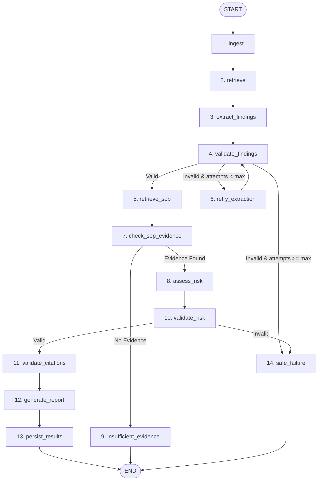

# Inspection Agent Architecture Specification

**Project:** SovereignAI — Sovereign On-Premise Industrial AI Workbench  
**Component:** Inspection Agent (LangGraph StateGraph Engine)  
**Author:** SovereignAI Core Architecture Team  
**Date:** September 3, 2026  
**Status:** Canonical & Authoritative  

---

## 1. Architectural Overview

```text
               Authenticated Client Request
                            │
                            ▼
               [ Backend Express Controller ]
               (Validates Tenant JWT & Document)
                            │
                            ▼
          [ LangGraph StateGraph Orchestrator ]
           (Compiled InspectionAgentState)
                            │
   ┌────────────────────────┼────────────────────────┐
   │                        │                        │
   ▼                        ▼                        ▼
[ Local Qdrant ]      [ Local Ollama ]      [ PostgreSQL DB ]
(Vector Retrieval)     (LLM Inference)        (Persistence)
   │                        │                        │
   └────────────────────────┼────────────────────────┘
                            │
                            ▼
             [ Approval Note DOCX Generator ]
                  (python-docx Compiler)
                            │
                            ▼
                 [ Human Review Boundary ]
          (Decision Support with Formal Sign-Off)
```

---

## 2. Canonical LangGraph Node Pipeline



---

## 3. Detailed Node Specifications

### Node 1: `ingest`
- **Purpose:** Ingests inspection PDF into page-aware text chunks and vectors.
- **Inputs:** `state.filePath`, `state.documentId`, `state.organizationId`.
- **Outputs:** `state.ingestionResult` (`{ documentId, filename, chunksStored }`).
- **Failure Behavior:** Records error in `state.errors`, marks `status = 'failed'`.
- **Evidence:** Retains raw page chunks and byte offsets.

### Node 2: `retrieve`
- **Purpose:** Executes multi-aspect vector retrieval against the target document in Qdrant.
- **Inputs:** `state.documentId`, `state.task`.
- **Outputs:** `state.retrievalResults` (ranked chunks).
- **Failure Behavior:** Returns empty array or safe failure.

### Node 3: `extract_findings`
- **Purpose:** Prompts local Ollama (`llama3.2:3b`) with retrieved inspection context in JSON mode.
- **Inputs:** `state.retrievalResults`, `state.task`.
- **Outputs:** `state.findings` conforming to finding schema (`equipment`, `parameter`, `observedValue`, `limit`, `evidence`, `severity`).
- **Failure Behavior:** Emits `status = 'failed'`, records extraction attempt count.

### Node 4: `validate_findings`
- **Purpose:** Deterministic structural schema validator for extracted findings.
- **Inputs:** `state.findings`.
- **Outputs:** `state.findingValidation` (`{ isValid, status, error }`).
- **Routing:**
  - `isValid === true` $\rightarrow$ `retrieve_sop`
  - `isValid === false && attempts < 2` $\rightarrow$ `retry_extraction`
  - `isValid === false && attempts >= 2` $\rightarrow$ `safe_failure`

### Node 5: `retrieve_sop`
- **Purpose:** Searches confidential SOP collection in Qdrant with `documentType: "sop"` metadata filter.
- **Inputs:** Extracted finding parameter and equipment.
- **Outputs:** `state.sopEvidence` (authoritative SOP text chunks).
- **Filter Enforced:** `must: [{ key: "documentType", match: { value: "sop" } }]`.

### Node 6: `check_sop_evidence`
- **Purpose:** Evaluates whether retrieved SOP chunks contain sufficient governing rules.
- **Inputs:** `state.sopEvidence`.
- **Outputs:** `state.sopEvidenceStatus` (`'EVIDENCE_FOUND'` | `'NO_EVIDENCE'`).
- **Routing:**
  - `'EVIDENCE_FOUND'` $\rightarrow$ `assess_risk`
  - `'NO_EVIDENCE'` $\rightarrow$ `insufficient_evidence` (prevents LLM hallucination).

### Node 7: `assess_risk`
- **Purpose:** Synthesizes technical analysis comparing observed finding against retrieved SOP limit.
- **Inputs:** `state.findings`, `state.sopEvidence`.
- **Outputs:** `state.riskAssessment` (`{ level, reason }`), `state.recommendation`, raw `citations`.
- **Failure Behavior:** Routes to `safe_failure`.

### Node 8: `validate_risk`
- **Purpose:** Validates risk level (`LOW` | `MEDIUM` | `HIGH` | `null`) and non-empty recommendation.
- **Inputs:** `state.riskAssessment`, `state.recommendation`.
- **Outputs:** `state.riskValidation` (`{ isValid, status }`).

### Node 9: `validate_citations`
- **Purpose:** Deterministic anti-hallucination filter comparing cited filenames and pages against retrieved chunks.
- **Inputs:** Raw candidate citations, `state.sopEvidence`.
- **Outputs:** `state.citations` (purged of fabricated citations).

### Node 10: `generate_report`
- **Purpose:** Compiles executive-ready `Approval_Note.docx` using `python-docx`.
- **Inputs:** Formatted findings, risk assessment, recommendation, validated citations.
- **Outputs:** `state.report` (`{ filename, filePath, downloadUrl }`).
- **Sections:** Subject, Background, Findings, Technical Analysis, Risk, Recommendation, References, Approval Signatures.

### Node 11: `insufficient_evidence`
- **Purpose:** Safe terminal node when no applicable SOP threshold is matched.
- **Outputs:** `workflowOutcome = 'INSUFFICIENT_EVIDENCE'`, zero hallucinated approval note.

### Node 12: `safe_failure`
- **Purpose:** Safe terminal node on unrecoverable extraction or validation failures.
- **Outputs:** `workflowOutcome = 'SAFE_FAILURE'`, `status = 'failed'`.

---

## 4. Human Governance Boundary
The Inspection Agent operates strictly in **Decision Support Mode**:
1. All recommendations are categorized as **Advisory**.
2. Generated DOCX deliverables terminate with **Section 8: Approval Signatures** requiring human engineering review before operational authorization.
3. The AI agent never marks a document as formally "Approved".
