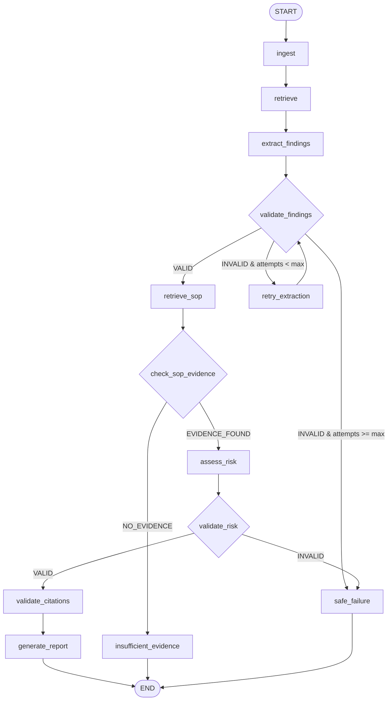

# SovereignAI — LangGraph Phase 4: Conditional Routing, Validation & Bounded Retry

**Phase:** Phase 4 — Conditional Decision Graph & Bounded State Machine  
**Date:** September 2, 2026  
**Status:** Completed, Verified & Production Default  
**Package:** `@langchain/langgraph` v1.4.x  
**Feature Flag:** `INSPECTION_ORCHESTRATOR=langgraph` (Default) | `legacy` (Rollback)

---

## 1. Executive Summary

Phase 4 transforms the SovereignAI production inspection pipeline from a linear sequence into a **deterministic, conditional decision graph**. 

While Phase 3 proved that the LangGraph StateGraph could replace the legacy imperative pipeline without regression, Phase 4 introduces automated validation boundaries, self-healing bounded retry loops, and fail-closed branches that halt execution safely before invalid or ungrounded data can produce an executive Approval Note deliverable.

All domain operations continue to rely on the established local on-premise foundation:
- **Local Ollama Inference:** `llama3.2:3b`
- **Self-Hosted Qdrant:** 384-dimensional cosine vector similarity search
- **Local ONNX Embeddings:** `all-MiniLM-L6-v2`
- **Authoritative SOP Filtering:** Strict `documentType="sop"` boundary
- **Anti-Hallucination Citations:** Evidence overlap verification
- **Isolated PostgreSQL:** Multi-tenant catalog and report persistence
- **Artifact Compilation:** Native DOCX generation via `python-docx`

---

## 2. Why Conditional Routing Was Introduced

In production document pipelines, linear workflows suffer from three fundamental vulnerabilities:
1. **Unchecked Output Formatting:** If an LLM returns malformed JSON or omits required evidence fields, a linear graph pushes invalid objects to downstream risk services.
2. **Missing Authoritative Evidence:** If no matching SOP standard exists for an inspection anomaly, a linear graph may tempt the LLM to invent an operating limit or risk classification.
3. **Uncontrolled Retries:** Naive retry logic without bounded counters risks infinite execution loops or resource exhaustion on local inference servers.

Phase 4 resolves all three vulnerabilities by embedding explicit validation nodes and conditional edges directly into the LangGraph state machine.

---

## 3. Graph Architecture



---

## 4. State Extensions (`InspectionAgentState`)

The state schema in [`backend/src/orchestration/inspection/inspection.state.js`](file:///Users/pushpentiwari/sovereign-ai-workbench/backend/src/orchestration/inspection/inspection.state.js) was extended with seven explicit channels using LangGraph reducers:

| State Channel | Reducer | Default | Purpose |
| :--- | :--- | :--- | :--- |
| `findingValidation` | `replaceReducer` | `null` | Validation object `{ isValid: boolean, status: "VALID"\|"INVALID", error?: string }` |
| `extractionAttempts` | `replaceReducer` | `1` | Integer counter tracking extraction and repair passes |
| `maxExtractionAttempts`| `replaceReducer` | `2` | Hard ceiling preventing infinite retry loops |
| `sopEvidenceStatus` | `replaceReducer` | `null` | Evidence presence indicator (`"EVIDENCE_FOUND"` \| `"NO_EVIDENCE"`) |
| `riskValidation` | `replaceReducer` | `null` | Risk validation object `{ isValid: boolean, status: "VALID"\|"INVALID", error?: string }` |
| `failureReason` | `replaceReducer` | `null` | Canonical human-readable reason for workflow abortion or failure |
| `workflowOutcome` | `replaceReducer` | `null` | Terminal outcome code (`"SUCCESS"` \| `"INSUFFICIENT_EVIDENCE"` \| `"SAFE_FAILURE"`) |

---

## 5. Validation Nodes & Decision Boundaries

### 5.1 Findings Validation (`validateFindingsNode`)
- **Location:** Executed immediately following `extract_findings` or `retry_extraction`.
- **Logic:**
  - Verifies that `state.findings` is an array.
  - Validates that legitimate clean reports with `0` findings pass as valid (`isValid: true`).
  - For each finding, asserts that `finding` and `evidence` are non-empty strings.
- **Routing:**
  - `VALID` $\rightarrow$ `retrieve_sop`
  - `INVALID` & `extractionAttempts < maxExtractionAttempts` $\rightarrow$ `retry_extraction`
  - `INVALID` & `extractionAttempts >= maxExtractionAttempts` $\rightarrow$ `safe_failure`

### 5.2 Bounded Retry Node (`retryExtractionNode`)
- **Location:** Executed when extraction validation fails and attempts remain.
- **Logic:** Increments `state.extractionAttempts` and re-invokes the structured extraction adapter passing `{ retry: true, lastError: ... }`.
- **Next Node:** Directly routes back to `validate_findings`. The graph guarantees that no more than 2 attempts occur.

### 5.3 SOP Evidence Check (`checkSopEvidenceNode`)
- **Location:** Executed immediately following `retrieve_sop`.
- **Logic:** Checks whether any chunks were retrieved under `documentType="sop"`. Reuses `state.sopEvidence` without making a redundant Qdrant call.
- **Routing:**
  - `EVIDENCE_FOUND` $\rightarrow$ `assess_risk`
  - `NO_EVIDENCE` $\rightarrow$ `insufficient_evidence`

### 5.4 Insufficient Evidence Node (`insufficientEvidenceNode`)
- **Location:** Terminal branch when no authoritative SOP exists for observed anomalies.
- **Safety Guarantee:** Halts without calling the LLM to invent an operating limit. Sets `riskAssessment.level = null`, assigns `INSUFFICIENT_EVIDENCE_RESULT`, logs `workflowOutcome = "INSUFFICIENT_EVIDENCE"`, skips `generate_report`, and terminates at `END`.

### 5.5 Risk Output Validation (`validateRiskNode`)
- **Location:** Executed immediately following `assess_risk`.
- **Logic:** Validates that `riskAssessment.level` strictly belongs to the set `{"LOW", "MEDIUM", "HIGH", null}` and that `reason` and `recommendation` are non-empty strings.
- **Routing:**
  - `VALID` $\rightarrow$ `validate_citations`
  - `INVALID` $\rightarrow$ `safe_failure`

### 5.6 Safe Failure Node (`safeFailureNode`)
- **Location:** Terminal branch for unrecoverable validation failures.
- **Safety Guarantee:** Sets `status = "failed"` and `workflowOutcome = "SAFE_FAILURE"`, records the root cause into `errors`, skips report generation, and halts at `END`. Does not crash the Node.js process.

---

## 6. Anti-Hallucination Citation Verification

`validateCitationsNode` preserves the strict evidence matching logic implemented in `filterValidCitations`:
1. Every citation returned by the LLM is checked against the authoritative chunks in `state.sopEvidence`.
2. Any citation with a fabricated `documentId`, page, or chunk index that was not actually retrieved is stripped from the state.
3. Only citations verified against Qdrant-grounded SOP chunks are passed into the final Approval Note DOCX.

---

## 7. Multi-Tenant Scoping & Referential Integrity

- `organizationId` is forwarded through the state from incoming HTTP requests (`x-organization-id` header).
- Ingestion indexing, SOP search filtering, document catalog insertion, and PostgreSQL report records strictly enforce `organization_id = $1`.
- Verified in `reports.test.js`: zero leaked reports across differing organization IDs.

---

## 8. Rollback Strategy

The feature flag mechanism established in Phase 3 remains fully functional:
```bash
# Rollback to legacy imperative orchestrator
export INSPECTION_ORCHESTRATOR=legacy

# Return to Phase 4 LangGraph conditional orchestrator (default)
export INSPECTION_ORCHESTRATOR=langgraph
```

---

## 9. Comprehensive Test Results

All 10 test suites executed and passed with **0 regressions**:

| Test Suite | Command | Result | Details |
| :--- | :--- | :--- | :--- |
| **Phase 4 LangGraph Suite** | `npm run test:graph` | **36/36 PASSED** | Valid path, retry recovery, max retry boundary, zero findings, insufficient evidence, invalid risk, citation verification |
| **Migration & Equivalence** | `node tests/inspection.migration.test.js` | **15/15 PASSED** | Feature flag switching, schema parity, tenant isolation, zero findings |
| **Structured Output Extraction** | `node tests/inspection.structured.test.js` | **6/6 PASSED** | Schema parser, markdown fence stripping, retry logic |
| **Model Router** | `node tests/router.test.js` | **14/14 PASSED** | Task classification, model routing, fallback behavior |
| **Coding Sandbox** | `node tests/sandbox.test.js` | **7/7 PASSED** | Docker container execution, timeout, network isolation |
| **Multimodal Vision** | `node tests/vision.test.js` | **14/14 PASSED** | Magic bytes, vision model routing, structured image findings |
| **Inspection Workflow & Reports** | `node tests/reports.test.js` | **PASSED** | Live HTTP POST `/api/v1/inspection/workflow`, report persistence |
| **Chat Persistence & RAG** | `node tests/chat.test.js` | **PASSED** | Multi-turn chat persistence, Qdrant grounding |
| **Autonomous Tool Loop Agent** | `node tests/agent.test.js` | **25/25 PASSED** | Tool whitelist, safe calculator, file bounds |
| **Backend Integration E2E** | `node tests/backend.e2e.test.js` | **PASSED** | End-to-end HTTP lifecycle from PDF upload to DOCX deliverable |
