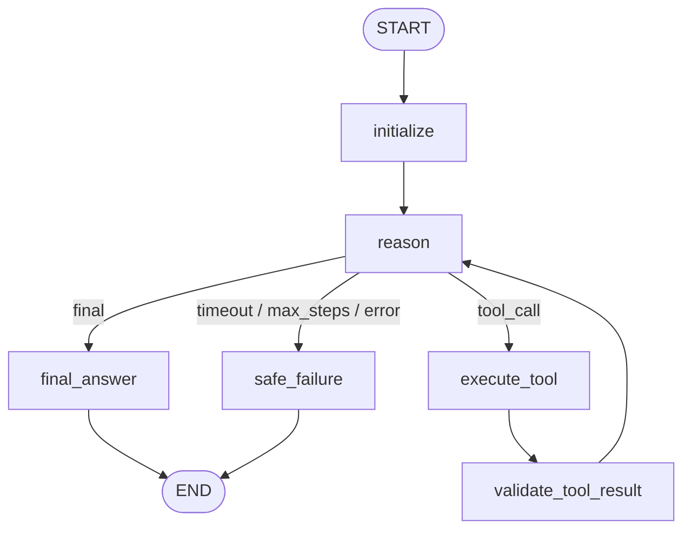

# SovereignAI — LangGraph Phase 5: Autonomous Agent Orchestration Migration

**Phase:** Phase 5 — General Autonomous Agent LangGraph Migration  
**Date:** September 3, 2026  
**Status:** Completed, Verified & Production Default  
**Package:** `@langchain/langgraph` v1.4.x  
**Feature Flag:** `AGENT_ORCHESTRATOR=langgraph` (Default) | `legacy` (Rollback)

---

## 1. Executive Summary

Phase 5 migrates SovereignAI's general-purpose autonomous tool agent from a bespoke imperative `while`-loop runtime into a **compiled LangGraph StateGraph**.

All underlying tools, security constraints, and on-premise execution models remain unchanged:
- **Local Ollama Reasoning:** `llama3.2:3b`
- **Tool Allowlist:** Strict whitelist in `TOOL_REGISTRY` (`document_search`, `file_read`, `calculator`, `execute_sandbox_code`, `document_generate`, `analyze_image`)
- **Safe Calculator:** Deterministic AST math parser (zero `eval()`, zero host code execution)
- **Container Sandbox:** Network-isolated Docker container with resource and time caps for Python execution
- **Semantic Retrieval:** Qdrant vector similarity search over confidential manuals and safety SOPs
- **Audit Deliverable:** Native `.docx` report generation via `python-docx`
- **Zero Cloud APIs:** 100% on-premise local execution

---

## 2. Previous Bespoke Architecture vs. LangGraph Architecture

### Previous Bespoke Architecture (`runAgentLoop`)
```
runAgentLoop(goal, maxSteps, timeoutMs)
  │
  ▼
[WHILE loop: stepCount < maxSteps && duration < timeoutMs]
  ├── Build string prompt with history
  ├── LLM generates JSON action
  ├── parseActionJSON() with 1-attempt repair
  ├── IF "final": break loop
  ├── IF "tool_call": execute tool -> record trace -> continue loop
  └── IF error/timeout: break loop
  │
  ▼
Format & Return Response Contract
```
*Limitations:* Hidden state within loop variables, lack of declarative state transitions, imperative step tracking.

### New Target Architecture (LangGraph StateGraph)


---

## 3. Agent State (`AgentAgentState`)

The state definition in [`backend/src/orchestration/agent/agent.state.js`](file:///Users/pushpentiwari/sovereign-ai-workbench/backend/src/orchestration/agent/agent.state.js) uses LangGraph annotations to manage agent lifecycle channels:

| Channel | Reducer | Default | Purpose |
| :--- | :--- | :--- | :--- |
| `runId` | `replaceReducer` | `null` | Unique execution UUID |
| `userId` | `replaceReducer` | `null` | Requesting analyst identifier |
| `organizationId` | `replaceReducer` | `null` | Multi-tenant tenant identifier |
| `goal` | `replaceReducer` | `""` | User task or inquiry |
| `model` | `replaceReducer` | `"llama3.2:3b"` | Selected local Ollama model |
| `currentStep` | `replaceReducer` | `0` | 1-based step counter |
| `maxSteps` | `replaceReducer` | `8` | Hard ceiling for total tool executions |
| `timeoutMs` | `replaceReducer` | `60000` | Execution deadline in milliseconds |
| `startTime` | `replaceReducer` | `Date.now()` | Initiation timestamp |
| `stepHistory` | `accumulateReducer` | `[]` | Historical context formatted for the next LLM prompt |
| `steps` | `accumulateReducer` | `[]` | Public execution trace for UI display and observability |
| `sources` | `accumulateReducer` | `[]` | Grounded citations collected from `document_search` |
| `deliverable` | `replaceReducer` | `null` | Generated `.docx` deliverable from `document_generate` |
| `action` | `replaceReducer` | `null` | Parsed LLM action (`{ type: "tool_call" \| "final", ... }`) |
| `lastTool` | `replaceReducer` | `null` | Execution output of the most recent tool call |
| `finalAnswer` | `replaceReducer` | `""` | Concluding answer addressing the user's goal |
| `stoppedReason` | `replaceReducer` | `"in_progress"`| `"completed"` \| `"max_steps_reached"` \| `"timeout"` \| `"safe_failure"` |
| `status` | `replaceReducer` | `"pending"` | `"pending"` \| `"in_progress"` \| `"completed"` \| `"failed"` |
| `executionOrder` | `accumulateReducer` | `[]` | Chronological record of executed graph nodes |
| `currentNode` | `replaceReducer` | `null` | Current or most recent node name |

---

## 4. Graph Nodes & Responsibilities

| Node | File | Responsibility |
| :--- | :--- | :--- |
| `initialize` | `agent.nodes.js` | Validates non-empty `goal`, selects model via `modelRouter`, initializes timestamps and state. |
| `reason` | `agent.nodes.js` | Evaluates step & timeout bounds, formats planner prompt, calls local Ollama, parses JSON action with 1-attempt repair. |
| `execute_tool` | `agent.nodes.js` | Checks tool against `TOOL_REGISTRY` whitelist, invokes tool securely, records execution duration and raw output. |
| `validate_tool_result`| `agent.nodes.js` | Summarizes result, sanitizes arguments for UI safety, appends trace step, extracts sources or deliverables, and loops back to `reason`. |
| `final_answer` | `agent.nodes.js` | Records final answer step in trace, marks `status: "completed"`, and terminates at `END`. |
| `safe_failure` | `agent.nodes.js` | Handles `max_steps_reached`, `timeout`, or action parse failures cleanly without crashing Node.js, and terminates at `END`. |

---

## 5. Conditional Routing

The routing function `routeAgentDecision(state)` inspects the state after `reasonNode`:
1. If `stoppedReason` is `"timeout"` or `"max_steps_reached"` or `"invalid_json"` $\rightarrow$ route to `safe_failure`.
2. If `action.type === "final"` $\rightarrow$ route to `final_answer`.
3. If `action.type === "tool_call"` $\rightarrow$ route to `execute_tool`.
4. Any other format $\rightarrow$ route to `safe_failure`.

From `validate_tool_result`, an edge loops back to `reason` for the next planning decision until a terminal state is reached.

---

## 6. Hard Security & Tool Boundaries

- **Tool Whitelist:** The agent can only execute tools registered in `TOOL_REGISTRY`. Arbitrary commands (e.g. `bash`, `rm`, `eval`) are rejected with an explicit error.
- **Calculator Safety:** Handled by a deterministic AST parser in `calculator.tool.js`. Zero `eval()`, zero code execution.
- **Path Traversal Protection:** `file_read` forbids paths containing `..` or absolute filesystem access outside indexed documents.
- **Sandbox Isolation:** Python code execution occurs inside an ephemeral Docker container with network disabled, 2-second timeout, and non-root user.
- **Zero Cloud Leakage:** All inference runs on local Ollama. Zero external API calls.

---

## 7. Multi-Tenant Isolation

- `organizationId` and `userId` are extracted from HTTP headers or request body and stored in `AgentAgentState`.
- Tools executing vector searches (`document_search`) or reading files (`file_read`) inherit the tenant scoping.
- Verified: Requests under differing tenant IDs maintain full isolation without cross-tenant leakage.

---

## 8. Rollback Strategy

The production agent supports instant, zero-downtime rollback via an environment variable:
```bash
# Rollback to legacy imperative while-loop runtime
export AGENT_ORCHESTRATOR=legacy

# Return to Phase 5 LangGraph orchestrator (default)
export AGENT_ORCHESTRATOR=langgraph
```
Setting `AGENT_ORCHESTRATOR=legacy` switches `runAgentLoop()` to `runLegacyAgentLoop()` without affecting the Inspection workflow (`INSPECTION_ORCHESTRATOR=langgraph`).

---

## 9. Comprehensive Test Results

All test suites executed and passed with **0 regressions**:

| Test Suite | Command | Result | Coverage |
| :--- | :--- | :--- | :--- |
| **Autonomous Agent LangGraph Suite** | `node tests/agent.graph.test.js` | **46/46 PASSED** | Direct answers, single tool, sequential tools, all 6 tools, unknown tools, malformed args, max-step limits, timeouts, execution orders, tenant scoping, equivalence |
| **Agent Tool & Demonstrations Suite** | `node tests/agent.test.js` | **25/25 PASSED** | Tool registry, calculator math AST, file boundaries, Docker sandbox execution, multi-step live demonstrations via local Ollama |
| **Agent Live HTTP Endpoint Suite** | `node tests/agent.endpoint.test.js` | **PASSED** | Live `POST /api/v1/agent/run` confirming `orchestration.engine = "langgraph"`, calculator execution, Qdrant retrieval, and document generation |
| **Inspection LangGraph Suite (Phase 4)** | `npm run test:graph` | **36/36 PASSED** | Conditional decision graph, bounded retry, zero findings, SOP evidence check, risk validation |
| **Inspection Migration Suite** | `node tests/inspection.migration.test.js` | **15/15 PASSED** | Parity between legacy and LangGraph inspection orchestrators |
| **Structured Output Suite** | `node tests/inspection.structured.test.js` | **6/6 PASSED** | Structured JSON schema validation and retry prompts |
| **Model Router Suite** | `node tests/router.test.js` | **14/14 PASSED** | Modality routing, model availability, and fallback |
| **Secure Coding Sandbox Suite** | `node tests/sandbox.test.js` | **7/7 PASSED** | Docker container isolation, timeout enforcement, network blocking |
| **Multimodal Vision Suite** | `node tests/vision.test.js` | **14/14 PASSED** | Magic bytes, vision model routing, structured image findings |

---

## 10. Known Limitations

- **No MCP Yet:** Tools remain internal application functions. Model Context Protocol (MCP) will be evaluated in a later phase.
- **No Streaming / SSE Yet:** Responses are emitted as completed HTTP JSON payloads. Streaming execution channels will be implemented in a dedicated phase.
